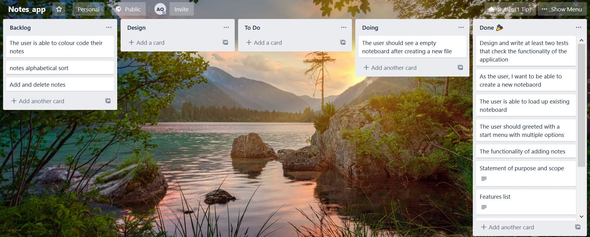

# Terminal Notes

  

## Statement of Purpose and Scope


This terminal application allows the user to create and organise short notes in a offline terminal environment. It will save data onto the user's pc for ease of access and privacy.

This application help users organise their thoughts and things to do in a easy to read and simple to edit manner. The notes will be saved locally and come back to at any time. The program will help anyone who needs to organise daily tasks, reminders and much more.

The intended audience is anyone who wants extra help in remembering information using a minimalist format. By opening the program and creating a note, it will be on display on the terminal interface. Users can also edit and sort notes as they see fit

## Features and functionality

### Notes Display

All user created notes will be on display on the noteboard for perusal and editing. A clean table format will be used for ease of use. A menu will be at the bottom for noteboard options.

### Adding and delete notes

The user will be able to easily add and delete notes as they see fit, keeping the noted board up to date. There is a character limit of 200 to encourage concise writing.

  
### Save and loading notes

The application will allow users to save notes onto local pc and when the user resumes the application they can choose to reload the notes board or create a new one.

### Sorting notes

The user will be able to sort notes to alphabetical manner by title name to quickly look for the note they desire. The user will be able to colour code notes as well

  
## User interaction and experience
 

The user experience outline after loading up the app will be :

- A menu that lists existing saved notes board, create new notes board and help page. Creating a new board will write a new file to computer. Where as selecting a existing board will lead the application reading a notes file from the directory.

- Be presented with the noteboard where all notes will reside. It will be displayed like a table format and user can create and assign colours to individual notes. These colour labels can be used for easy identification. The noteboard files will be lightweight CSV files.


- Menu options will be presented at the bottom with the ability to add, delete and sort notes. When adding notes is selected, a new page will appear with space to write a note, title and choose colour. Options to save and discard will be at the top. When delete option is selected, the user enters the title of note they want to delete. Sorting notes can be done by the title alphabetically or by colour.

- The Notes will be character limited to force concise language and readability. If notes are too long, a notice will pop up when user try to save the note

## Control flow diagram


  
## Implementation plan



[Trello](https://trello.com/b/MtACGzWI/notesapp)


## Installation

First, [download and install Ruby](https://www.ruby-lang.org/en/documentation/installation/) on your computer.

```

sudo apt-get install ruby

```

Install Bundler Gem:

```

gem install bundler

```

Next step is to clone the repository from Github and run the application by entering the following command in the terminal.


```

sh -c "\$(curl -fsSL https://raw.githubusercontent.com/AlexQ6/Notes_App/master/src/run.sh)

  
```

### Gems used

Terminal notes utilizes the following gems. All of these gems are stored in the Gemfile.

[colorize](https://rdoc.info/github/fazibear/colorize)

[tty-file](https://github.com/piotrmurach/tty-file)

[artii](https://github.com/miketierney/artii)

[tty-prompt](https://www.rubydoc.info/gems/tty-prompt)

[tty-table](https://github.com/piotrmurach/tty-table)

[test-unit](https://www.rubydoc.info/gems/test-unit/3.1.8)


### Links

[GitHub](https://github.com/AlexQ333/Notes_App)

## Manual testing

| Feature | Description | Expected Outcome | Actual Outcome | Sidenote |
| ------ | ------ | ------- | ------- | ------ |
| Start menu | An ascii art title with menu | When the application is ran, ascii art title should appear as well as menu | As expected | None 
| Create new noteboard | Start menu has a "New noteboard" option |W hen the option is selected, a new file is created within the directory | As expected | None 
| Load new noteboard | Start menu has a "Load existing noteboard" option | When the option is selected, existing files appears as options | As expected | None 
| Delete noteboard file | Within "Load existing noteboard" menu, there's a delete option | When the option is selected, program asks user for name of file to be deleted and executes | As expected | None  
| Add note | Making sure add_note function inserted data into CSV | New data is CSV | As expected | None 
| ARGV terminal arguments | The arguments ran with main.rb launches help file and other app features | Option for new noteboard opens, existing noteboard appear in menu, help file opens | As expected | None 


